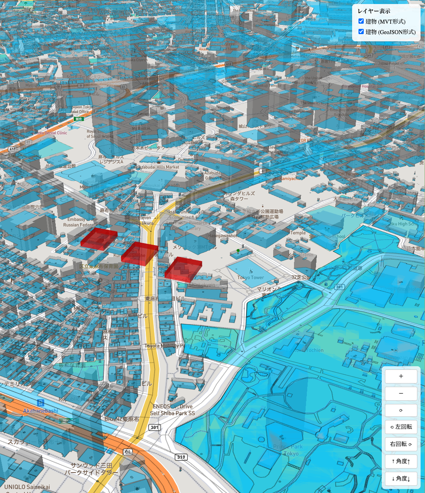
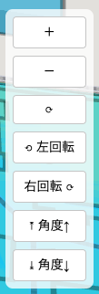
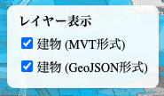
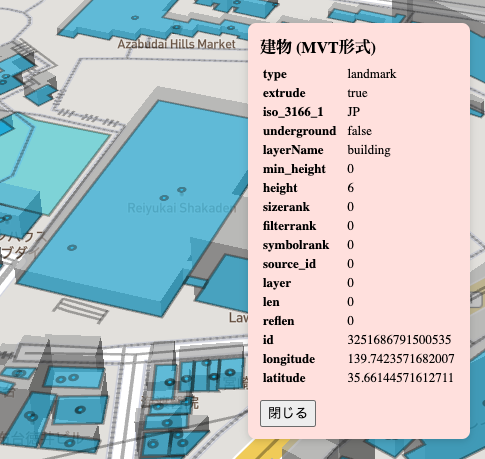
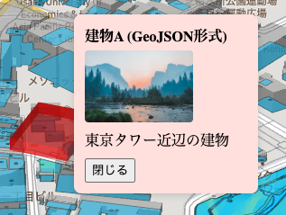
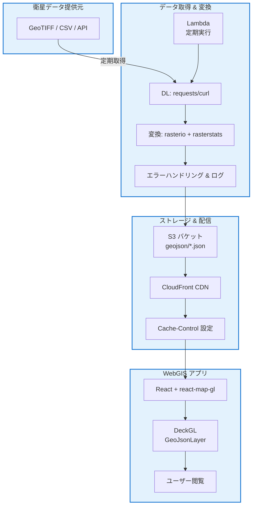
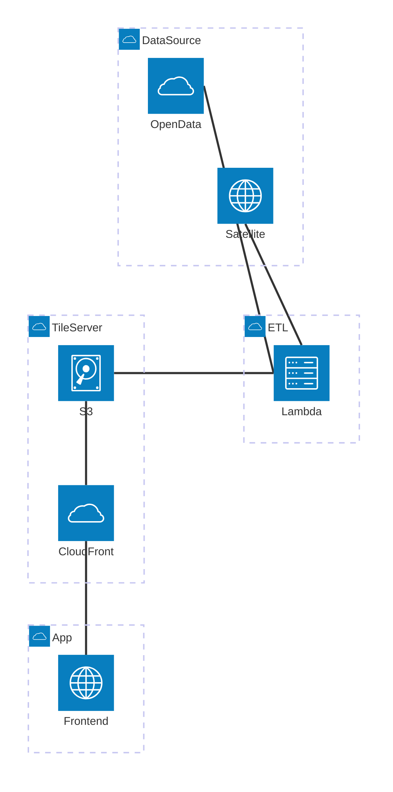

# mapbox-sample

3D 地図ライブラリ Mapbox による都市緑化ポテンシャルマップの検証プロトタイプ

## 技術スタック

### フロントエンド
- **React + TypeScript** - コンポーネント志向による保守性の高い開発
- **Vite** - 高速な開発サーバーと HMR (Hot Module Replacement)
- **Mapbox GL JS** - ベースマップの表示とベクタータイル処理
- **react-map-gl** - Mapbox GL JS の React ラッパー
- **Deck.gl** - WebGL ベースの高性能データ可視化レイヤー

### データ形式
- **GeoJSON** - 地理空間データの交換形式
- **Protocol Buffers (.pbf)** - ベクタータイルのバイナリ形式
- **GLB** - 3D モデル形式（glTF 2.0 バイナリ）

## 環境構築

- ローカル環境: http://localhost:5173/
- Vercel デプロイ: https://mapbox-sample-gules.vercel.app/

### 環境変数のセット

https://console.mapbox.com/account/access-tokens/ でアクセストークンを取得する。

```sh
cp .env.example .env
```

して、 `.env` の `VITE_MAPBOX_TOKEN` にアクセストークンをセットする。

```sh
VITE_MAPBOX_TOKEN=hogefuga
```

### パッケージのインストール

```sh
pnpm i
```

### 起動

```sh
pnpm dev
```

## プロトタイプ概要



本プロトタイプは、Mapbox と Deck.gl を組み合わせて都市緑化ポテンシャルの可視化システムを検証するために開発した。東京タワー近辺を対象エリアとして、建物データの配信形式の比較や、すでに緑化されているエリアへの 3D 樹木モデルの配置方法を検証している。

### 主な機能

#### 操作パネル

|                   地図操作パネル                    |                   レイヤー切り替えパネル                   |
| :-------------------------------------------------: | :--------------------------------------------------------: |
|   |  |
| ズームイン/アウト、地図の回転、傾き角度の調整が可能 |       MVT 形式と GeoJSON 形式の表示/非表示を切り替え       |

地図の視点操作を直感的に行うためのパネルと、建物データの配信形式を比較検証するためのレイヤー切り替えパネルを実装。タッチデバイスやマウス操作に加えて、ボタン操作による精密な制御を提供している。

#### Feature ID による建物データの表示

|                         MVT 形式                         |                           GeoJSON 形式                           |
| :------------------------------------------------------: | :--------------------------------------------------------------: |
|  |  |
|               Feature プロパティの詳細表示               |                     カスタムプロパティの表示                     |

建物をクリックすると、その建物の Feature ID や座標情報を取得してポップアップに表示する。本実装では衛星画像解析から得た都市緑化ポテンシャル情報を紐付けて表示することを想定している。

#### 既存緑化エリアの 3D 表現


既存緑化エリアを表現するため、Blender の Python スクリプティングで作成した 3D 樹木モデル（ `.glb` 形式）を `ScenegraphLayer` で配置。円錐（幹）と球体（葉）を組み合わせたシンプルなモデルを、東京タワー近辺で既存緑化エリアと仮定した建物に配置して検証している。

## 検証・調査したこと

### 既存緑化エリアと緑化ポテンシャルエリアの表現方法

都市緑化ポテンシャルの可視化において、既存緑化エリアと緑化可能なエリアをどのように区別して表現するかを検証した。簡易的なポリゴンは GeoJSON や MVT で表現可能だが、既存緑化エリアの植物のような複雑な形状には `.glb` 形式が必要であることが分かった。実際に Blender の Python スクリプティング機能を使って 3D 樹木モデルを作成し、東京タワー近辺で既存緑化エリアと仮定した建物に配置することに成功した。

### データの差分読み込みによる最適化

大規模なデータを扱う際のパフォーマンス向上のため、以下の手法を調査した。

| 通常版                        | 差分読み込み版            | 用途                   | 特徴                                         |
| ----------------------------- | ------------------------- | ---------------------- | -------------------------------------------- |
| `.geojson` ( `GeoJSONLayer` ) | `.pbf` ( `MVTLayer` )     | 簡易的なポリゴンの配置 | ズームレベルに応じたタイル単位の動的読み込み |
| `.glb` ( `ScenegraphLayer` )  | `.b3dm` ( `Tile3DLayer` ) | 複雑な 3D モデルの配置 | 3D モデルの LOD (Level of Detail) 制御       |

品川区や東京都全体への拡張を見据え、 `.b3dm` 形式による 3D タイル化が有効であると考えられる。また、MVT 形式への変換には `tippecanoe` などのタイルビルダーが利用可能である。本実装に落とし込む際には実際の差分読み込みの実装が必要となる。

### 建物データとの連携

Mapbox の建物ベクタータイルが持つ Feature ID を活用し、クリック時のポップアップに建物固有の都市緑化ポテンシャル情報を表示する仕組みを実装した。Mapbox の建物データは週次で更新されるため、最新の建物情報を反映できる。これにより、衛星画像解析結果や屋上耐荷重データなどの外部情報を建物ごとに紐付けることが可能である。

### 日照シミュレーションの制限

Mapbox Standard のライティング機能では `dawn` 、`day` 、`dusk` 、`night` の 4 つのプリセットのみが利用可能で、時間帯や季節による詳細な影の変化を表現するには制限があることが判明した。より高度な日照シミュレーションが必要な場合は、他のライブラリとの併用を検討する必要がある。

### コストとスケーラビリティ

Mapbox は月あたり5万ロードまで無料で利用可能。小規模な検証やプロトタイプ開発に適している。大規模展開を見据えた場合、タイルサーバーを S3 + CloudFront で構築し、コスト最適化を図ることが可能。

### データ変換のパフォーマンス

PLATEAU の CityGML から GeoJSON への変換に `ogr2ogr` を使用した際、約 24 分を要した。大規模データの変換処理には Lambda やバッチ処理の工夫が必要である。

## 今後の拡張構想

### アーキテクチャ

データのフローチャート：



アーキテクチャ図：



### データパイプライン

上記の Mermaid 図で示したアーキテクチャは、以下の3層構造で構成される：

1. **データ取得・変換層**
   - Lambda を用いて衛星データを定期的に取得し、Python ライブラリ（ `rasterio` 、`rasterstats` ）で画像処理を行う
   - 処理済みの GeoJSON データは `tippecanoe` を使用して PBF 形式のベクタータイルに変換する

2. **タイルサーバー層**  
   - 生成されたタイルデータは S3 バケットに保存し、CloudFront CDN 経由で配信することで高速化を実現
   - 適切な Cache-Control ヘッダーを設定し、効率的なキャッシングを行う

3. **アプリケーション層**
   - React と Deck.gl を組み合わせた WebGIS アプリケーションとして、エンドユーザーに高性能な地図表示を提供
   - 将来的にはリアルタイムでのデータ更新機能も実装可能
